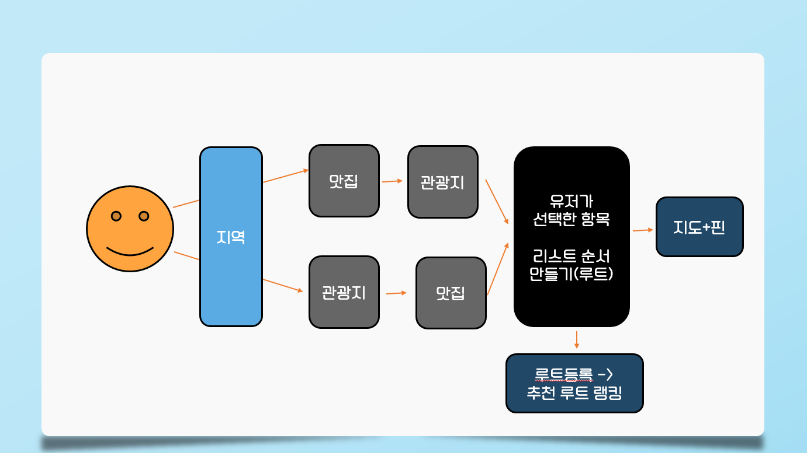
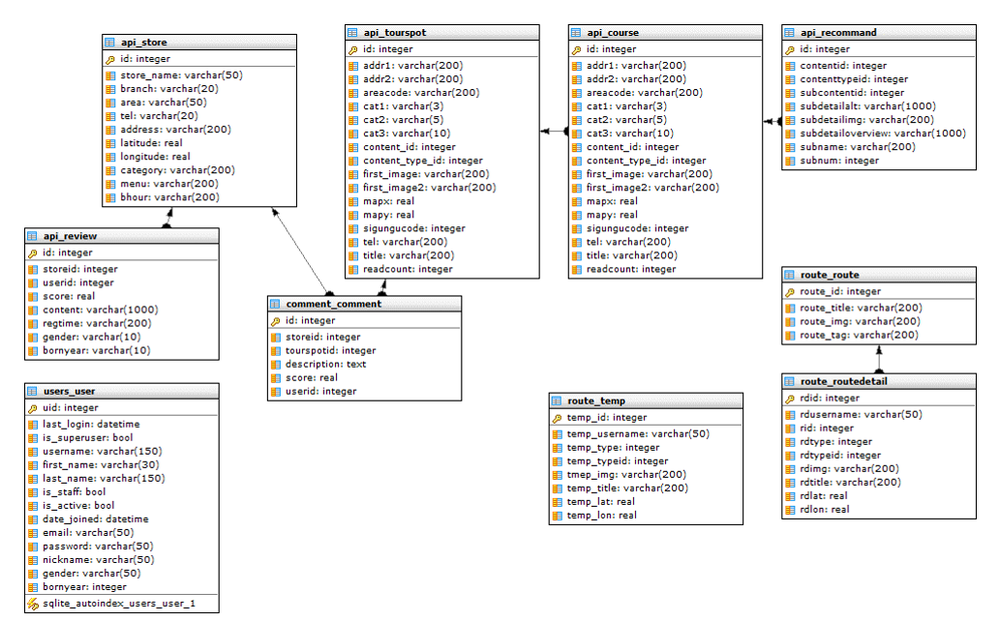

# :scroll: :airplane: 종이비행기

## 목차
- [팀소개](#팀소개)
- [개요](#개요)
- [기능](#기능)
- [향후 전망](#향후-전망)
- [기술 스택](#기술-스택)
- [기술 설명](#기술-설명)
	- [ERD](#erd)
	- [디렉토리 구조도](#디렉토리-구조도)
	- [TMI](#TMI)
- [테스트 방법](#테스트-방법)

## 팀소개 :runner: :walking:

### 삼시새끼
> '밥 잘 먹는 아이들'이라는 뜻으로, 힘든 프로젝트지만 밥 잘 먹고 열심히 하자는 의미를 담았습니다. 

:bento: [front-end] 손예지	

:spaghetti: [front-end] 김영남	

:meat_on_bone: [back-end] 김영호	

:croissant: [back-end] 송복민	

:hamburger: [back-end] 이동현

## 개요 :black_nib:

> 맛집, 관광지 빅데이터를 기반으로 하여 사용자가, 맛집과 관광지를 추천받고, 나만의 루트도 커스텀할 수 있는 플랫폼

## 기능

#### PICK MYSELF :triangular_flag_on_post:
> 사용자 친화적인 검색 시스템과 사용자가 직접 선택하는 본인만의 리스트를 제공합니다.
> Provides a user-friendly search system and your own personal list of choices.

#### EASY VIEW :world_map:
> 선택한 리스트를 바로 지도에서 확인할 수 있습니다.
> You can view the selected list directly on the map.

#### RANK AND RECOMMEND :trophy:
> 다른 사용자가 만든 경로와 기본적으로 제공하는 추천 경로를 볼 수 있습니다.
> You can view paths created by other users and recommended paths provided by default.

#### Data Amount

> :fork_and_knife: 맛집 459K :coffee:

> :camping: 관광지 25K :beach_umbrella:

> :bullettrain_front: 추천 경로 9M :red_car:

## 기대 효과
> 효율적인 루트 여행 루트를 짤 수 있습니다.
> 빅데이터기반의 추천을 받아 만족스러운 여행을 기획할 수 있습니다.

## 기술 스택

## 기술 설명

#### 거리 기반 필터링

#### 아이템 기반 협업필터링
> 메뉴-메뉴 유사도 행렬 (:ice_cream:-:ramen:)

### ERD

### 디렉토리 구조도

#### sub1
    - parse.py
    - collaboratedByMenu.py

#### sub2

**backend**

	- api
	- backend
	- comment
	- route
	- users
	
**frontend**

	- api
	- components
	- store
	- views
	

### TMI

> PJT 종이비행기 이름의 유래 : 종이비행기처럼 가벼운 마음으로 웹 사이트에 접속해 즐거운 여행을 떠났으면 하는 마음에 지었습니다.

## 테스트 방법 :computer:
> http://j3b303.p.ssafy.io/